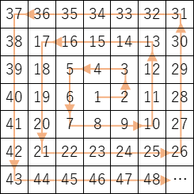
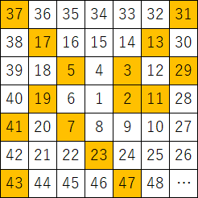
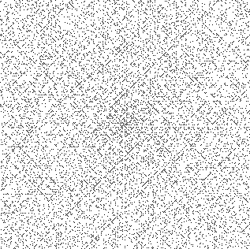
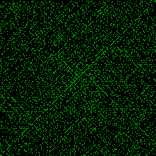

# ウラムの螺旋とは
[ウラムの螺旋 - Wikipedia](https://ja.wikipedia.org/wiki/%E3%82%A6%E3%83%A9%E3%83%A0%E3%81%AE%E8%9E%BA%E6%97%8B)

素数の分布を以下の様なルールに従って可視化したものです。

1. 自然数を反時計回りに螺旋状に並べます。



2. 素数のマス目のみ塗り潰します。



3. これを繰り返していくと、不思議なことに斜め方向に格子状のパターンが浮かび上がってきます。




# 実装
素数判定には様々なアルゴリズムがありますが、今回は自前で実装は行わず、[sympy.sieve](https://docs.sympy.org/latest/modules/ntheory.html)を使用しています。
list型として扱えるので、素数判定は以下のように1行で書けます。

```Python
n in sieve
```

以下、実装です。

```Python
import cv2
import numpy as np
from sympy import sieve


def ulam_spiral(start_num, end_num, prime_color=(0, 0, 0), back_color=(255, 255, 255)):

    # 始点を(0, 0)として、螺旋の座標リストを作成する
    pos = [(0, 0)]
    # 螺旋は右に1、上に1、左に2、下に2、右に3、上に3、左に4、下に4…と進む
    count = 1
    while len(pos) < (end_num - start_num):
        for c in range(count):
            pos.append((pos[-1][0] + 1, pos[-1][1]))  # 右に進む
        for c in range(count):
            pos.append((pos[-1][0], pos[-1][1] - 1))  # 上に進む
        for c in range(count+1):
            pos.append((pos[-1][0] - 1, pos[-1][1]))  # 左に進む
        for c in range(count+1):
            pos.append((pos[-1][0], pos[-1][1] + 1))  # 下に進む
        count += 2
    pos = pos[:end_num - start_num]  # 不要な末尾を削除

    # 最小座標を取得し、左上が(0, 0)となるよう補正
    min_x = min([p[0] for p in pos])
    min_y = min([p[1] for p in pos])
    pos = [(p[0]-min_x, p[1]-min_y) for p in pos]

    # 背景画像を作成
    max_x = max([p[0] for p in pos])
    max_y = max([p[1] for p in pos])
    img = np.zeros((max_y+1, max_x+1, 3), np.uint8)
    img[:] = back_color

    # 開始番号から順番に素数判定、素数の場合はposの座標に従い色を変更
    for n, p in zip(range(start_num, end_num), range(len(pos))):
        if n in sieve:
            img[pos[p][1], pos[p][0]] = prime_color

    # 画像出力
    img = cv2.cvtColor(img, cv2.COLOR_BGR2RGB)
    cv2.imwrite('ulam_spiral' + str(start_num) + '-' + str(end_num) + '.png', img)


def main():
    start_num = 1
    end_num = 100000
    prime_color = (0, 255, 0)
    back_color = (0, 0, 0)
    ulam_spiral(start_num, end_num, prime_color, back_color)


if __name__ == '__main__':
    main()

```

# オイラーの素数生成多項式
実装は、螺旋の開始番号/終了番号を変更できるようにしています。
開始番号を41にすると、中心から斜め方向に連続して素数が現れ、長い直線のパターンが出てきます。
中心から斜め方向のマス目の値は、$x^2 + x + q 　(x≧0, q:開始番号)$ で表される整数となりますが、この式はオイラーの素数生成多項式と等しいです。
オイラーの素数生成多項式では、$q=41$のとき、$x$が$0$から$39$までの間連続して素数が出続けるので、ウラムの螺旋で比較的長い直線のパターンが出るのも納得です。



# さいごに
実装に関して、少し注意事項と感想です。

- 螺旋の最も外側の列は、正しく描画されない可能性があります。終了番号end_numが螺旋のどこの位置で終わるか分からないためです。(そこまで厳密な図が欲しいわけではなかったのでご愛嬌ということで)
- 螺旋の座標リストを作る部分があまり綺麗ではないです。他にもっと良いやり方があれば知りたい…
- 引数指定で無駄にカラフルな図を出力できます。折角なのでデスクトップにしてみましたがチカチカするのでおすすめしません。
